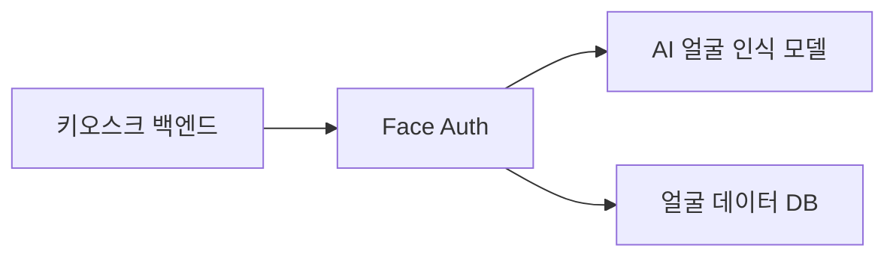
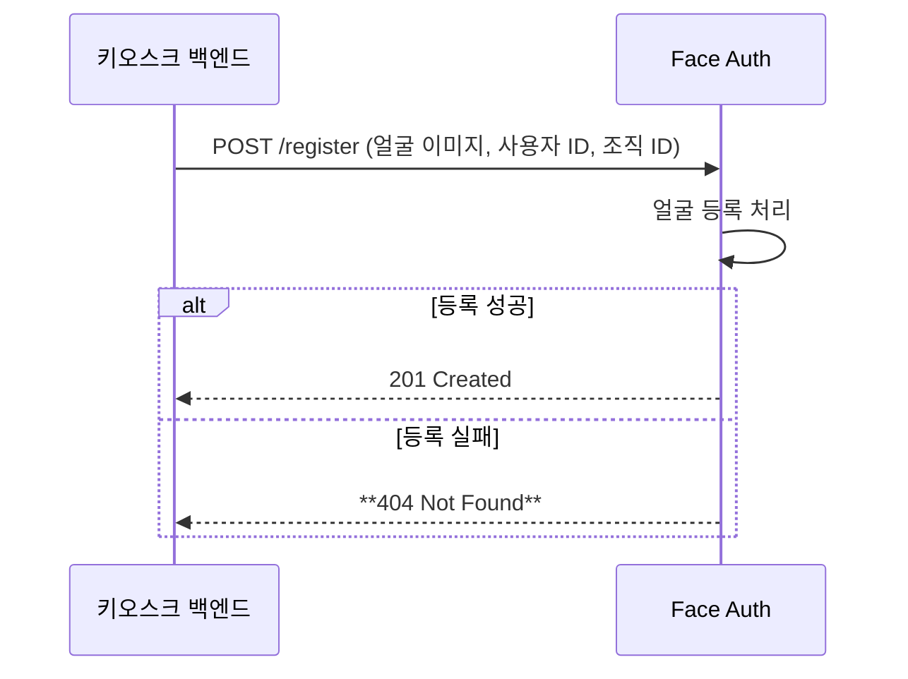
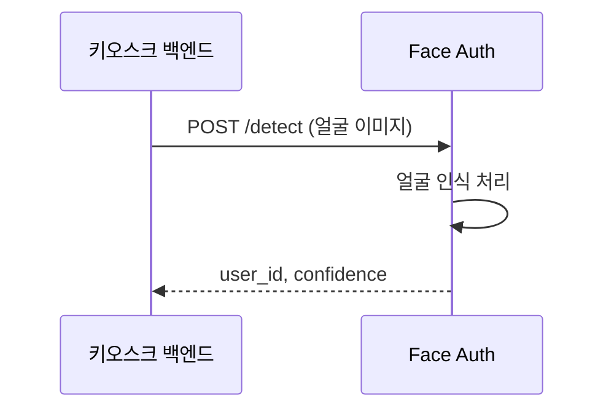

# 키오스크 얼굴 인증 시스템 API 문서

> **Last Updated:** 2025.09.19
> 
> 
> **Base URL:** `https://*******/api/v1`
> 
> **Local Development:** `http://localhost:8000/api/v1`
> 

---

<aside>
❗ 주의 사항

- 큰 이미지 사이즈 처리 시 `GPU 처리`에 부하가 생길 수 있으며, 인식 대기 시간이 늘어날 수 있습니다. (추천: HD)
- 어두운 사진을 업로드하면 얼굴 인식이 어려울 수 있습니다.
- 이미지를 업로드할 때는 추가로 얼굴 CROP할 필요 없이 그대로 전달해야 합니다.
</aside>

### 시스템 아키텍처



---

## 인증 및 얼굴 등록 워크플로우

### 얼굴 등록 시퀀스 다이어그램



### 인증 시퀀스 다이어그램



---

## 📊 API Endpoints

| 기능 | 권한 | Method | 엔드포인트 | 설명 |  |
| --- | --- | --- | --- | --- | --- |
| **인증** |  |  |  |  |  |
| 얼굴 등록 | Admin, Manager | `POST` | `/register` | 사용자 얼굴 등록 | ✅ |
| 얼굴 인식 | Admin, Manager, User | `POST` | `/detect` | 얼굴 인식으로 사용자 식별 | ✅ |
| **사용자 관리** |  |  |  |  |  |
| 사용자 목록 | Admin, Manager | `GET` | `/users` | 전체 사용자 조회 | ✅ |
| 사용자 상세 | Admin, Manager | `GET` | `/users/{user_id}` | 특정 사용자 정보 조회 | ✅ |
| 사용자 수정 | Admin, Manager | `PATCH` | `/users/{user_id}` | 사용자 정보 수정 | ✅ |
| 사용자 삭제 | Admin | `DELETE` | `/users/{user_id}` | 사용자 삭제 | ✅ |
| **얼굴 관리** |  |  |  |  |  |
| 얼굴 목록 | Admin, Manager | `GET` | `/users/{user_id}/faces` | 사용자의 등록된 얼굴 목록 | ✅ |
| 모든 얼굴 삭제 | Admin, Manager | `DELETE` | `/users/{user_id}/faces` | 특정 사용자의 모든 얼굴 이미지 삭제 | ✅ |
| 얼굴 삭제 | Admin, Manager | `DELETE` | `/users/{user_id}/faces/{face_id}` | 특정 얼굴 삭제 | ✅ |
| **조직 관리** |  |  |  |  |  |
| 조직 사용자 | Manager | `GET` | `/orgs/{org_id}/users` | 조직별 사용자 조회 |  |
| **시스템** |  |  |  |  |  |
| health check | Public | `GET` | `/health` | 시스템 상태 확인 | ✅ |

---

## 📝 API 상세 명세

### 1. 얼굴 등록 - `POST /register`

사용자의 얼굴을 시스템에 등록합니다.

🔒 **권한**: `Admin`, `Manager`

### Request

**Body `(multipart/form-data)`**

```jsx
{
  "image":   File,         // 필수: 얼굴 이미지 (jpg, png, jpeg)
  "user_id": string,       // 필수: 사용자 ID
  "org_id":  string,        // 필수: 조직 ID  
}
```

### Response

**성공 (201 Created)**

```json
{
  "success": true,
  "data": {
    "face_id": "876fqc5aa055f8e48226459e8",
    "user_id": "6891c34f055f8e48226459e5",
    "org_id": "4292c451055f8e4822645a02",
    "message": "사용자 얼굴이 성공적으로 등록되었습니다.",
    "registered_at": "2025-09-19T09:30:00Z"
  },
}
```

**실패 (422 Unprocessable Entity)**

```json
{
  "success": false,
  "error": {
    "code": "FACE_NOT_DETECTED",
    "message": "이미지에서 얼굴을 찾을 수 없습니다.",
  }
}
```

---

### 2. 얼굴 인식 (로그인) - `POST /detect`

사용자의 얼굴을 인식하합니다

### Request

**Headers**

```
Content-Type: multipart/form-data
```

**Body (multipart/form-data)**

```jsx
{
  "image": File,           // 필수: 얼굴 이미지  
  "org_id": string,        // 선택: 조직 ID (범위 제한용)  
}
```

### Response

**성공 (200 OK)**

```json
{
  "success": true,
  "data": {
    "user_id": "qwfqc5aa055f8e48226459e8",
    "org_id": "6891c34f055f8e48226459e5",
    "confidence": 0.96, // 0 ~ 1
    "message": "사용자가 성공적으로 인식되었습니다.",
    "detected_at": "2025-09-19T10:15:30Z"
  }
}
```

**실패 (404 Not Found)**

```json
{
  "success": false,
  "error": {
    "code": "USER_NOT_FOUND",
    "message": "사용자를 찾을 수 없습니다.",
  }
}
```

---

### 3. 사용자 목록 조회 - `GET /users`

등록된 모든 사용자 목록을 조회합니다.

🔒 **권한**: `Admin`

### Request

**Query Parameters**

| Parameter | Type | Required | Description |
| --- | --- | --- | --- |
| page | `Integer` | No | 페이지 번호 (기본: 1) |
| limit | `Integer` | No | 페이지당 항목 수 (기본: 20, 최대: 100) |
| org_id | `String` | No | 조직 ID로 필터링 |

Example:

```json
http://localhost:8000/api/v1/users/?page=1&limit=20&org_id=seoul
```

### Response

**성공 (200 OK)**

```json
{
  "success": true,
  "data": {
    "users": [
      {
        "user_id": "412qc5aa055f8e48226459e8",
        "org_id": "6891c34f055f8e4822645914",
        "face_count": 2,
        "is_active": true,
        "registered_at": "2025-09-19T10:00:00Z"
      },
      {
        "user_id": "6891c34f055f8e48226459e5",
        "org_id": "6891c34f055f8e4822645932",
        "face_count": 1,
        "is_active": true,
        "registered_at": "2025-09-19T11:00:00Z"
      }
    ],
    "pagination": {
      "page": 1,
      "limit": 20,
      "total_items": 150,
      "total_pages": 8,
      "has_next": true,
      "has_prev": false
    }
  }
}
```

---

### 4. 사용자 상세 정보 - `GET /users/{user_id}`

특정 사용자의 상세 정보와 등록된 얼굴 정보를 조회합니다.

### Response

**성공 (200 OK)**

```json
{
  "success": true,
  "data": {
    "user_id": "1121c34f055f8e48226459e5",
    "org_id": "2221c34f055f8e48226459e5",
    "is_active": true,
    "total_faces": 12,
    "created_at": "2025-09-19T10:00:00Z",
    "updated_at": "2025-09-19T09:30:00Z"
  }
}
```

---

### 5. 사용자 정보 수정 - `PUT /users/{user_id}`

사용자의 조직 또는 상태 정보를 수정합니다.

### Request

**Body**

```json
{
  "org_id": "6891c34f055f8e48226459e5", // 선택: 새 조직 ID
  "is_active": false,                   // 선택: true:active, false:inactive
}
```

### Response

**성공 (200 OK)**

```json
{
  "success": true,
  "data": {
     "user_id": "user123",
     "org_id": "org456",
     "is_active": true,
     "message": "사용자 정보가 성공적으로 업데이트되었습니다.",
     "updated_at": "2025-09-19T10:00:00Z"
  }
}
```

---

### 6. 사용자 삭제 - `DELETE /users/{user_id}`

사용자와 관련된 모든 얼굴 데이터를 삭제합니다.

> ⚠️ **주의**: 이 작업은 되돌릴 수 없습니다. 삭제 전 확인이 필요합니다.
> 

### Response

**성공 (200 OK)**

```json
{
    "success": true,
    "data": {
        "user_id": "test1",
        "face_count": 3,
        "message": "사용자가 성공적으로 삭제되었습니다.",
        "deleted_at": "2025-10-03T15:01:19.840344"
    }
}
```

**실패 (404 Not Found)**

```json
{
  "success": false,
  "error": {
    "code": "USER_NOT_FOUND",
    "message": "등록되지 않은 사용자입니다.",
  }
}
```

### 7. 사용자 얼굴 목록 조회  - `GET /users/{user_id}/faces`

특정 사용자의 등록된 모든 얼굴 목록을 조회합니다. 

🔒 **권한**: `Admin`, `Manager`

| Parameter | Type | Required | Description |
| --- | --- | --- | --- |
| page | `Integer` | No | 페이지 번호 (기본: 1) |
| limit | `Integer` | No | 페이지당 항목 수 (기본: 20, 최대: 100) |
| user_id | `Integer` | Yes | 사용자 ID |

### Response

**성공 (200 OK)**

```json
{
    "success": true,
    "data": {
        "user_id": "test",
        "org_id": "cgv",
        "total_faces": 4,
        "faces": [
            {
                "face_id": "505314e2-0b01-4ecb-83ac-143d0f8d13de",
                "image_url": "20251003_140257_b6252f.jpg",
                "registered_at": "2025-10-03T14:02:57.766275"
            },
            {
                "face_id": "5011287b-a40c-4d3b-839a-1dd470a1dc94",
                "image_url": "0251003_140257_7010fa.jpg",
                "registered_at": "2025-10-03T14:02:57.343939"
            },
            {
                "face_id": "f7ea7efb-8e91-4ae6-be4b-7a82b3dc4d4f",
                "image_url": "0251003_140256_7bb88d.jpg",
                "registered_at": "2025-10-03T14:02:56.892841"
            },
            {
                "face_id": "fd523e38-e89d-419a-9430-f7b9f0a30d85",
                "image_url": "0251003_140256_2bbf1b.jpg",
                "registered_at": "2025-10-03T14:02:56.253325"
            }
        ],
        "pagination": {
            "page": 1,
            "limit": 20,
            "total_items": 4,
            "total_pages": 1,
            "has_next": false,
            "has_prev": false
        }
    }
}
```

**실패 (404 Not Found)**

```json
{
  "detail": {
      "success": false,
      "error": {
          "code": "FACE_NOT_FOUND",
          "message": "얼굴 이미지를 찾을 수 없습니다."
      }
  }
}
```

### 8. 사용자의 모든 얼굴 이미지 삭제 - `DELETE /users/{user_id}/faces`

특정 사용자의 등록된 모든 얼굴 사진을 삭제합니다.

> ⚠️ **주의**: 이 작업은 되돌릴 수 없습니다. 삭제 전에 반드시 확인하시기 바랍니다.
> 

### Response

**성공 (200 OK)**

```json
{
  "success": true,
  "data": {
    "message": "사용자의 모든 얼굴 사진이 성공적으로 삭제되었습니다.",
    "deleted": {
      "user_id": "1121c34f055f8e48226459e5",
      "deleted_at": "2025-09-19T12:00:00Z"
    }
  }
}
```

**실패 (404 Not Found)**

```json
{
  "success": false,
  "error": {
    "code": "USER_NOT_FOUND",
    "message": "등록되지 않은 사용자입니다.",
  }
}
```

### 9. 얼굴 이미지 삭제 - `DELETE /users/{user_id}/faces/{face_id}`

특정 사용자의 등록된 얼굴 중 하나를 삭제합니다.

> ⚠️ **주의**: 이 작업은 되돌릴 수 없습니다. 삭제 전 확인이 필요합니다.
> 

### Response

**성공 (200 OK)**

```json
{
    "success": true,
    "data": {
        "face_id": "d5a81a0c-7018-494c-b60f-81104df84ba8",
        "user_id": "alisher",
        "message": "얼굴 성공적으로 삭제되었습니다."
    }
}
```

**실패: 404 Not Found)**

```json
{
    "detail": {
        "success": false,
        "error": {
            "code": "USER_NOT_FOUND",
            "message": "등록되지 않은 사용자입니다."
        }
    }
}
```

**실패: (404 Not Found):**

```json
{
  "success": false,
  "error": {
    "code": "FACE_NOT_FOUND",
    "message": "해당 얼굴 정보를 찾을 수 없습니다.",
  }
}
```

---

### 10. 조직별 사용자 조회 - `GET /orgs/{org_id}/users`

특정 조직에 속한 모든 사용자를 조회합니다.

| Parameter | Type | Required | Description |
| --- | --- | --- | --- |
| page | `Integer` | No | 페이지 번호 (기본: 1) |
| limit | `Integer` | No | 페이지당 항목 수 (기본: 20, 최대: 100) |
| org_id | `String` | YES | 조직 ID로 필터링 |
| has_face | `Boolean` | No | 얼굴 등록 여부 필터 |
| search | `String` | No | 사용자 이름 검색 |

### Response

**성공 (200 OK)**

```json
{
  "success": true,
  "data": {
    "org_id": "2411c34f055f8e4822645912",
    "total_users": 10,
    "users_with_faces": 5,
    "users": [
      {
        "user_id": "6891c34f055f8e48226459e5",
        "org_id": "6891c34f055f8e4822645932",
        "face_count": 1,
        "is_active": true,
        "registered_at": "2025-09-15T11:00:00Z"
      }
      // ...list of users
    ],
    "pagination": {
      "page": 1,
      "limit": 20,
      "total_items": 150,
      "total_pages": 8,
      "has_next": true,
      "has_prev": false
    }
  }
}
```

---

### 11. 헬스 체크 - `GET /health`

시스템 상태를 확인합니다.

### Response

**성공 (200 OK)**

```json
{
  "status": "healthy",
  "version": "1.0.0"
}
```

---

## 에러 처리

### 🚨 에러 응답 형식

모든 에러는 다음과 같은 통일된 형식으로 반환됩니다:

```json
{
  "success": false,
  "error": {
    "code": "ERROR_CODE",
    "message": "사용자에게 표시할 메시지"
  }
}
```

### 에러 코드 목록

| HTTP Status | Error Code | Description | 대응 방법 |
| --- | --- | --- | --- |
| **400** | `INVALID_IMAGE` | 잘못된 이미지 형식 | 이미지 형식 확인 (jpg, png, jpeg) |
| **400** | `INACTIVE_USER` | 비활성화된 사용자 | 관리자에게 사용자 상태 확인 요청 |
| **400** | `FACE_NOT_DETECTED` | 얼굴을 찾을 수 없음 | 다시 촬영 요청 |
| **404** | `FACE_NOT_FOUND` | 얼굴 이미지 없음 | 이미지 ID 확인 |
| **400** | `LOW_QUALITY` | 이미지 품질 부족 | 조명 개선 후 재촬영 |
| **404** | `USER_NOT_FOUND` | 사용자 없음 | 사용자 등록 필요 |
| **409** | `FACE_ALREADY_EXISTS` | 이미 등록된 얼굴 | 중복 확인 |
| **422** | `INVALID_FACE_ANGLE` | 부적절한 각도 | 정면 촬영 요청 |
| **429** | `RATE_LIMIT_EXCEEDED` | 요청 한도 초과 | 잠시 후 재시도 |
| **500** | `INTERNAL_ERROR` | 서버 내부 오류 | 관리자 문의 |
| **503** | `SERVICE_UNAVAILABLE` | 서비스 일시 중단 | 잠시 후 재시도 |
| **403** | `USER_RELATED_WITH_ANOTHER_ORG` | 다른 조직에 속한 사용자 | 조직 정보 확인 |
| **503** | `WORKER_UNAVAILABLE` | 처리 워커 비가용 상태 | 잠시 후 재시도 또는 관리자 문의 |

---
