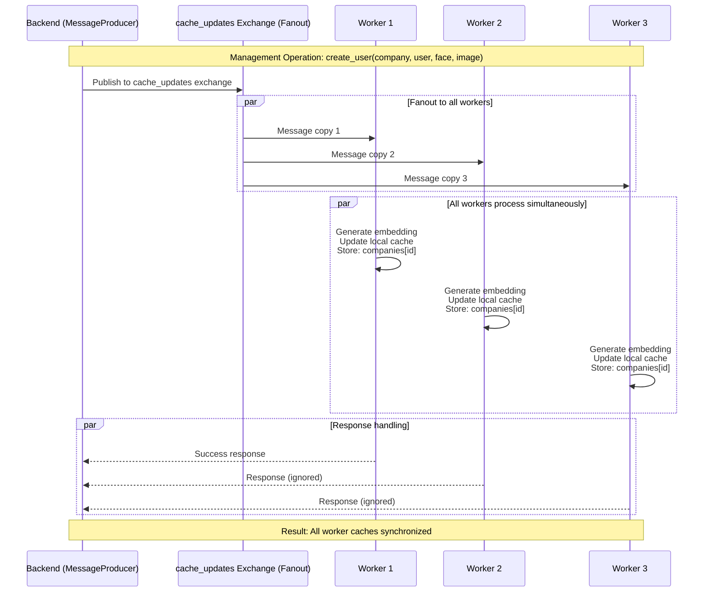
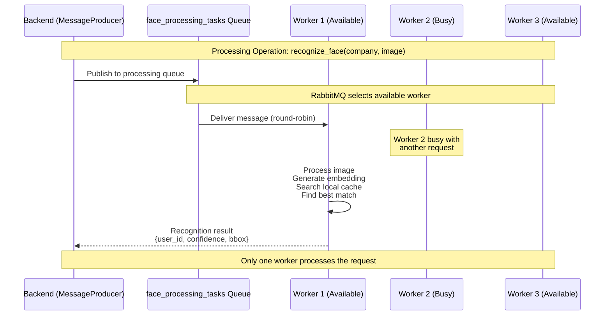
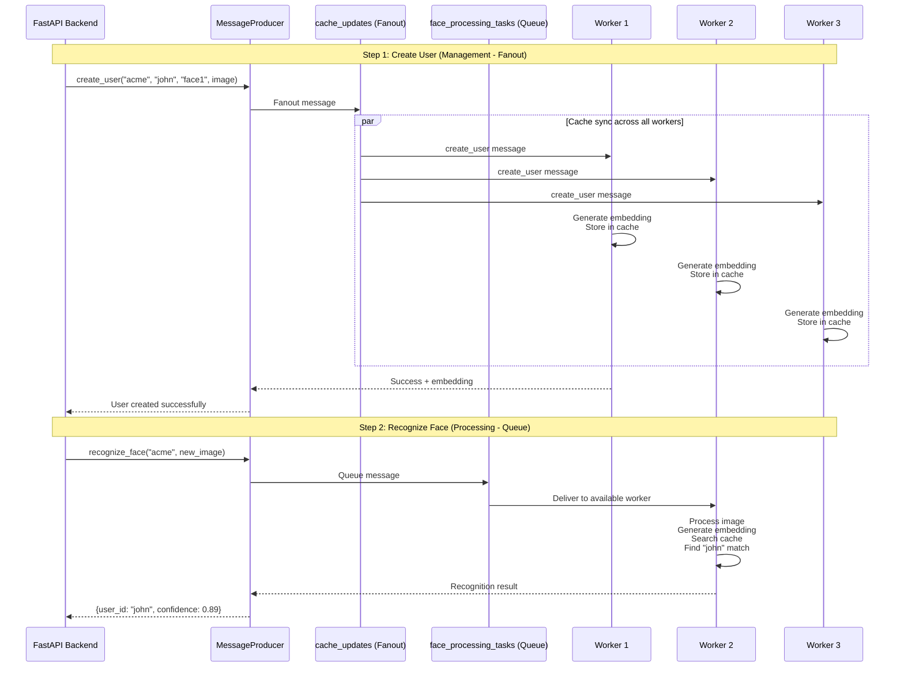

# Face Recognition Messaging System

A distributed messaging system for face recognition using RabbitMQ with fanout cache synchronization between workers and direct request-response patterns for processing tasks.

## Quick Start

### For Backend Developers

**Installation:**
```bash
# Install the broker client library
pip install -r broker/requirements.txt
```

**Basic Usage:**
```python
from broker import MessageProducer

# Create producer instance
with MessageProducer() as producer:
    # Create company
    producer.create_company("company_123")

    # Register user with face
    embedding = producer.create_user(
        company_id="company_123",
        user_id="john_doe",
        face_id="face_001",
        image_base64=base64_image
    )

    # Recognize face
    user_id, confidence, bbox = producer.recognize_face(
        company_id="company_123",
        image_base64=base64_image
    )
```

### System Setup (DevOps/Infrastructure)

**Prerequisites:**
- Docker and Docker Compose
- Python 3.9+

**Start Services:**
```bash
# Configure environment
cp .env.example .env
# Edit .env with your settings (optional - defaults work for local development)

# === DEVELOPMENT MODE (with live code reload) ===
# Use this during development - changes to code are reflected immediately without rebuilding
docker-compose -f docker-compose.yml -f docker-compose.dev.yml up

# Optional: Create a shell alias for convenience
alias dc-dev="docker-compose -f docker-compose.yml -f docker-compose.dev.yml"
dc-dev up

# Scale workers in dev mode
dc-dev up --scale face_worker=3

# === PRODUCTION MODE (code baked into image) ===
# Use this for production deployment - more secure, no host volume mounts
docker-compose up -d

# Scale workers for testing cache sync in production
docker-compose up --scale face_worker=3 -d

# Monitor RabbitMQ
# UI: http://localhost:15672 (face_user / secure_password)
```

**Development vs Production:**
- **Development (`docker-compose.dev.yml`)**:
  - Volume mounts enabled for live code changes
  - No need to rebuild containers after code edits
  - DEBUG logging enabled by default
  - Suitable for local development only

- **Production (`docker-compose.yml`)**:
  - No volume mounts - code is baked into the Docker image
  - Requires rebuild for code changes
  - More secure and performant
  - Use this for staging/production deployments

### Environment Configuration

The system supports `.env` files for easy configuration management:

#### Configuration Files
```bash
# Copy and customize environment settings
cp .env.example .env

# Available configuration files:
.env.example      # Template with all options (committed to git)
.env             # Local overrides (gitignored)
.env.production  # Production template (create as needed)
```

#### Environment Variables
```bash
# Database Settings
POSTGRES_DB=face_auth_db
POSTGRES_USER=face_auth_db
POSTGRES_PASSWORD=hg5HtRVB
POSTGRES_PORT=5432

# MinIO Settings
MINIO_ROOT_USER=face_auth_admin
MINIO_ROOT_PASSWORD=fvsGtRTY
MINIO_PORT=9000
MINIO_CONSOLE_PORT=9001
MINIO_PUBLIC_ENDPOINT=127.0.0.1:9000
MINIO_PUBLIC_SECURE=false
MINIO_ACCESS_KEY=minioadmin
MINIO_SECRET_KEY=minioadmin123

# RabbitMQ Connection
RABBITMQ_VHOST=/face_recognition
RABBITMQ_HOST=localhost
RABBITMQ_PORT=5672
RABBITMQ_USER=face_user
RABBITMQ_PASS=secure_password

# Publisher Settings
PUBLISHER_TIMEOUT=30
PUBLISHER_MAX_RETRIES=3

# Worker Settings
WORKER_MAX_RETRIES=5
WORKER_PREFETCH_COUNT=1
WORKER_PROCESSING_TIMEOUT=30.0

# Data Loading Configuration
DATA_SOURCE=API  # Options: LOCAL_FILE, API, or NONE
DATA_FILE=data/initial_db.json
API_URL=http://localhost:8000/api/v1/worker/
API_TIMEOUT=30

# Face Recognition Configuration
FACE_RECOGNITION_THRESHOLD=0.7  # Recognition confidence threshold (0.0-1.0)
FACE_DETECTION_THRESHOLD=0.5    # Face detection confidence threshold (0.0-1.0)

# Logging
LOG_LEVEL=INFO  # DEBUG, INFO, WARNING, ERROR
LOG_DIR=logs
```

#### Different Environment Setups
```bash
# Local development (uses .env file)
docker-compose up

# Production with environment file
docker-compose --env-file .env.production up

# Override specific variables
RABBITMQ_PASS=secret123 LOG_LEVEL=DEBUG docker-compose up
```

---

## Face Recognition Configuration

### Recognition Thresholds

The system uses configurable confidence thresholds to control face recognition accuracy:

**FACE_RECOGNITION_THRESHOLD** (default: 0.7)
- Minimum confidence score (0.0-1.0) required to match a face to a user
- **Lower values** (e.g., 0.5-0.6): More lenient, higher recall, more false positives
- **Higher values** (e.g., 0.8-0.9): More strict, higher precision, fewer false positives
- Recommended: Start at 0.7 and adjust based on accuracy tests

**FACE_DETECTION_THRESHOLD** (default: 0.5)
- Minimum confidence score for face detection in images
- Controls which detected faces are considered valid
- Rarely needs adjustment

### Tuning for Your Use Case

```bash
# High Security (e.g., access control)
FACE_RECOGNITION_THRESHOLD=0.8  # Strict matching

# Balanced (recommended default)
FACE_RECOGNITION_THRESHOLD=0.7  # Good balance

# High Availability (e.g., customer service)
FACE_RECOGNITION_THRESHOLD=0.6  # More lenient
```

**How to Update:**
1. Edit threshold in `.env` file
2. Restart workers: `docker-compose restart face_worker`
3. Monitor logs to see new threshold value
4. Test and adjust as needed

### Supported Image Formats

The worker accepts images in the following formats:
- **JPEG/JPG** - Most common, recommended
- **PNG** - Lossless, larger file sizes
- **WebP** - Modern format, good compression

Images must be base64-encoded when sent via the API.

---

## Worker Data Loading

### Overview

Workers load initial face recognition data (companies, users, faces, embeddings) at startup from one of three sources:
- **API**: Fetch from backend API endpoint (centralized, always up-to-date, production)
- **LOCAL_FILE**: Load from a JSON file (fast, offline, development/testing)
- **NONE**: Start with empty cache (data populated via management operations)

This enables workers to start with pre-existing face recognition data without waiting for management operations to populate their caches.

### Data Structure

Workers expect data in the following JSON format:

```json
{
  "companies": {
    "company_123": {},
    "company_456": {}
  },
  "users": {
    "company_123": {
      "user_001": {
        "user_id": "user_001",
        "faces": ["face_001", "face_002"]
      },
      "user_002": {
        "user_id": "user_002",
        "faces": ["face_003"]
      }
    },
    "company_456": {
      "user_003": {
        "user_id": "user_003",
        "faces": ["face_004", "face_005"]
      }
    }
  },
  "faces": {
    "company_123": [
      {
        "face_id": "face_001",
        "user_id": "user_001"
      },
      {
        "face_id": "face_002",
        "user_id": "user_001"
      }
    ],
    "company_456": [
      {
        "face_id": "face_004",
        "user_id": "user_003"
      }
    ]
  },
  "embeddings": {
    "face_001": [0.123, -0.456, 0.789, ...],
    "face_002": [0.234, -0.567, 0.890, ...],
    "face_003": [0.345, -0.678, 0.901, ...],
    "face_004": [0.456, -0.789, 0.012, ...],
    "face_005": [0.567, -0.890, 0.123, ...]
  }
}
```

**Field Descriptions:**
- `companies`: Map of company_id to empty objects (just existence tracking)
- `users`: Nested map of company_id → user_id → user data with face IDs
- `faces`: Map of company_id to arrays of face metadata (face_id and user_id)
- `embeddings`: Map of face_id to 512-dimensional embedding vectors

### Configuration: LOCAL_FILE Mode

Load data from a JSON file in the container filesystem.

**Setup:**

1. Create the data directory and file:
```bash
mkdir -p data
# Create or copy your initial_db.json file
```

2. Configure `.env`:
```bash
DATA_SOURCE=LOCAL_FILE
DATA_FILE=data/initial_db.json
```

3. Start workers:
```bash
docker-compose up -d
```

**Docker Compose Configuration:**
```yaml
services:
  face-worker:
    image: face-worker:latest
    environment:
      - DATA_SOURCE=LOCAL_FILE
      - DATA_FILE=/app/data/initial_db.json
    volumes:
      - ./data:/app/data:ro  # Mount data directory as read-only
```

**Advantages:**
- Fast startup (no network dependency)
- Works offline
- Good for development and testing
- Predictable data state

### Configuration: API Mode

Fetch data from a remote API endpoint at startup.

**Setup:**

1. Configure `.env`:
```bash
DATA_SOURCE=API
API_URL=http://api-server:8000/api/worker/initial-data
API_TIMEOUT=30
```

2. Ensure your API endpoint returns the JSON structure shown above

3. Start workers:
```bash
docker-compose up -d
```

**Docker Compose Configuration:**
```yaml
services:
  face-worker:
    image: face-worker:latest
    environment:
      - DATA_SOURCE=API
      - API_URL=http://api-server:8000/api/worker/initial-data
      - API_TIMEOUT=30
    depends_on:
      - api-server
```

**API Requirements:**
- Accept GET requests
- Return JSON with the structure shown above
- Respond within timeout period (default 30 seconds)

**Example API Implementation:**
```python
from fastapi import FastAPI

app = FastAPI()

@app.get("/api/worker/initial-data")
async def get_worker_data():
    # Fetch from database and return JSON
    return {
        "companies": {...},
        "users": {...},
        "faces": {...},
        "embeddings": {...}
    }
```

**Advantages:**
- Centralized data management
- Always up-to-date data
- No need to distribute data files
- Dynamic data updates

### Switching Between LOCAL_FILE and API

#### Method 1: Edit .env File (Permanent Change)

**Switch to LOCAL_FILE:**
```bash
# Edit .env
DATA_SOURCE=LOCAL_FILE
DATA_FILE=data/initial_db.json
# API_URL=http://api-server:8000/api/worker/data  # Comment out

# Restart workers
docker-compose restart face_worker
```

**Switch to API:**
```bash
# Edit .env
DATA_SOURCE=API
# DATA_FILE=data/initial_db.json  # Comment out
API_URL=http://api-server:8000/api/worker/initial-data
API_TIMEOUT=30

# Restart workers
docker-compose restart face_worker
```

#### Method 2: Command-Line Override (Temporary Testing)

**Test with LOCAL_FILE:**
```bash
docker-compose run --rm \
  -e DATA_SOURCE=LOCAL_FILE \
  -e DATA_FILE=/app/data/test_data.json \
  -v $(pwd)/test_data:/app/data:ro \
  face_worker python face_worker.py --test-mode
```

**Test with API:**
```bash
docker-compose run --rm \
  -e DATA_SOURCE=API \
  -e API_URL=http://staging-api:8000/api/worker/data \
  face_worker python face_worker.py --test-mode
```

#### Method 3: Multiple Configurations (Advanced)

**Create separate compose files:**

`docker-compose.local.yml`:
```yaml
services:
  face-worker:
    environment:
      - DATA_SOURCE=LOCAL_FILE
      - DATA_FILE=/app/data/initial_db.json
    volumes:
      - ./data:/app/data:ro
```

`docker-compose.api.yml`:
```yaml
services:
  face-worker:
    environment:
      - DATA_SOURCE=API
      - API_URL=http://api-server:8000/api/worker/data
```

**Run with specific configuration:**
```bash
# Use local file
docker-compose -f docker-compose.yml -f docker-compose.local.yml up -d

# Use API
docker-compose -f docker-compose.yml -f docker-compose.api.yml up -d
```

### Startup Logs

**Successful LOCAL_FILE startup:**
```
INFO - Loading initial data from local file: data/initial_db.json
INFO - Loaded 5 companies
INFO - Loaded 150 users across 5 companies
INFO - Loaded 300 faces across 5 companies
INFO - Loaded 300 embeddings
INFO - Data consistency validation passed
INFO - ============================================================
INFO - Initial Data Statistics:
INFO -   Companies: 5
INFO -   Total Users: 150
INFO -   Total Faces: 300
INFO -   Total Embeddings: 300
INFO - ============================================================
```

**Successful API startup:**
```
INFO - Loading initial data from API: http://api-server:8000/api/worker/initial-data
INFO - Loaded 5 companies
INFO - Loaded 150 users across 5 companies
INFO - Successfully loaded data from API
INFO - Data consistency validation passed
```

### Troubleshooting

#### Issue: Data file not found
```
WARNING - Data file not found: data/initial_db.json, starting with empty data
```

**Solution:**
- Verify file exists: `ls -la data/initial_db.json`
- Check volume mount in docker-compose.yml
- Ensure file path is correct in DATA_FILE

#### Issue: API timeout
```
ERROR - API request timed out after 30 seconds
```

**Solution:**
- Increase timeout: `API_TIMEOUT=60`
- Check API server is running: `curl http://api-server:8000/health`
- Verify network connectivity between containers

#### Issue: Invalid JSON
```
ERROR - Invalid JSON in data file: Expecting ',' delimiter
```

**Solution:**
- Validate JSON: `cat data/initial_db.json | python -m json.tool`
- Check for syntax errors
- Ensure file is properly formatted

#### Issue: Data consistency warnings
```
WARNING - Data consistency issues found: 3
WARNING -   - Face face_006 has no embedding
```

**Solution:**
- Ensure all face_ids in users.faces have corresponding embeddings
- Verify all faces in faces array have matching embeddings
- Check that referenced companies exist

### Best Practices

**Development:**
- Use LOCAL_FILE with test data
- Keep test files in version control (without sensitive data)
- Use `--test-mode` to verify data loading

**Staging:**
- Use API with staging endpoint
- Test timeout settings
- Verify data consistency after loading

**Production:**
- Use API for centralized data management
- Monitor startup logs for loading issues
- Set appropriate timeout values
- Use HTTPS for API endpoints

---

### Enhanced Logging and Debugging

The face worker includes comprehensive logging to help with testing and debugging:

#### Log Levels and Output
```bash
# Start workers with different log levels
docker-compose up --scale face_worker=3 -d  # Default INFO level

# For debugging, create .env with:
LOG_LEVEL=DEBUG  # DEBUG, INFO, WARNING, ERROR

# Or override for single run:
LOG_LEVEL=DEBUG docker-compose up
```

#### Real-time Log Monitoring
```bash
# Watch all worker logs
docker-compose logs -f face_worker

# Watch specific worker
docker logs -f $(docker ps -q --filter "label=service=face_worker" | head -1)

# Filter for specific message types
docker-compose logs face_worker | grep "Processing task"
docker-compose logs face_worker | grep "Loading initial data"
docker-compose logs face_worker | grep "ERROR"
```

---

## For Backend Developers

This section provides comprehensive documentation on using the `MessageProducer` API to integrate face recognition into your backend application.

### Producer API Reference

#### Basic Setup

```python
from broker import MessageProducer, ProducerConfig, get_config_from_env

# Method 1: Simple usage with defaults (loads from .env)
with MessageProducer() as producer:
    # Your operations here
    pass

# Method 2: Custom configuration
config = ProducerConfig(
    host='localhost',
    timeout=60,
    max_retries=5,
    heartbeat=600
)

with MessageProducer(config) as producer:
    # Your operations here
    pass

# Method 3: Load from environment
config = get_config_from_env()
producer = MessageProducer(config)

# Configuration precedence:
# 1. Explicitly passed ProducerConfig parameters
# 2. Environment variables
# 3. .env file values
# 4. Default values
```

#### Company Management

**Create Company**
```python
success = producer.create_company(company_id="company_123")
```

**Returns:**
- `success`: `bool`
  - `True` if company created successfully
  - `True` if company already exists (idempotent)

**Edge Cases:**
```python
# Case 1: New company
success = producer.create_company("company_123")
# Returns: True

# Case 2: Company already exists
success = producer.create_company("company_123")
# Returns: True (idempotent operation)

# Case 3: Empty company ID
success = producer.create_company("")
# Raises: ValueError("Company ID cannot be empty")
```

**Errors:**
- `ConnectionError`: RabbitMQ connection failed
- `TimeoutError`: Worker didn't respond within timeout
- `ValueError`: Invalid company_id

**Delete Company**
```python
success = producer.delete_company(company_id="company_123")
```

**Returns:**
- `success`: `bool`
  - `True` if company deleted successfully
  - `False` if company doesn't exist

**Important:** Deletes ALL users and faces associated with the company.

**Edge Cases:**
```python
# Case 1: Delete existing company (cascades to all users and faces)
success = producer.delete_company("company_123")
# Returns: True (company and all associated users/faces removed)

# Case 2: Delete non-existent company
success = producer.delete_company("nonexistent_company")
# Returns: False

# Case 3: Delete empty company (no users)
success = producer.delete_company("empty_company")
# Returns: True
```

#### User Management

**Create User with First Face**
```python
embedding = producer.create_user(
    company_id="company_123",
    user_id="john_doe",
    face_id="face_001",
    image_base64="base64_encoded_image"
)
```

**Returns:**
- `embedding`: `List[float]`
  - 512-dimensional face embedding vector
  - Extracted from the provided image

**Edge Cases:**
```python
# Case 1: Successful user creation
embedding = producer.create_user("company_123", "john_doe", "face_001", face_image)
# Returns: [0.123, -0.456, ...] (512 values)

# Case 2: Company doesn't exist
embedding = producer.create_user("nonexistent_company", "john", "face_1", image)
# Raises: ProducerError("Company does not exist")

# Case 3: User already exists
embedding = producer.create_user("company_123", "john_doe", "face_001", image)
# Raises: ProducerError("User already exists")

# Case 4: No face detected in image
embedding = producer.create_user("company_123", "john", "face_1", no_face_image)
# Raises: ProducerError("No face detected in image")

# Case 5: Invalid image data
embedding = producer.create_user("company_123", "john", "face_1", "invalid_base64")
# Raises: ProducerError("Image processing failed")

# Case 6: Multiple faces in image - uses first detected
embedding = producer.create_user("company_123", "john", "face_1", group_photo)
# Returns: embedding of first detected face
```

**Errors:**
- `ProducerError`: Invalid image, no face detected, company/user issues
- `ConnectionError`: RabbitMQ connection failed
- `TimeoutError`: Worker didn't respond

**Add Additional Face to User**
```python
embedding = producer.add_face(
    company_id="company_123",
    user_id="john_doe",
    face_id="face_002",
    image_base64="base64_image_data"
)
```

**Returns:**
- `embedding`: `List[float]`
  - 512-dimensional face embedding for the new face

**Edge Cases:**
```python
# Case 1: Successfully add second face
embedding = producer.add_face("company_123", "john_doe", "face_002", face_image)
# Returns: [0.234, -0.567, ...] (512 values)

# Case 2: User doesn't exist
embedding = producer.add_face("company_123", "nonexistent_user", "face_2", image)
# Raises: ProducerError("User does not exist")

# Case 3: Face ID already exists for this user
embedding = producer.add_face("company_123", "john_doe", "face_001", image)
# Raises: ProducerError("Face ID already exists for this user")

# Case 4: No face detected
embedding = producer.add_face("company_123", "john_doe", "face_2", no_face_image)
# Raises: ProducerError("No face detected in image")
```

**Delete User**
```python
success = producer.delete_user(company_id="company_123", user_id="john_doe")
```

**Returns:**
- `success`: `bool`
  - `True` if user deleted successfully
  - `False` if user doesn't exist

**Important:** Deletes ALL faces associated with the user.

**Edge Cases:**
```python
# Case 1: Delete existing user
success = producer.delete_user("company_123", "john_doe")
# Returns: True (all faces removed)

# Case 2: Delete non-existent user
success = producer.delete_user("company_123", "nonexistent_user")
# Returns: False

# Case 3: User with multiple faces - all deleted
success = producer.delete_user("company_123", "user_with_3_faces")
# Returns: True (all 3 faces removed)
```

**Delete Specific Face**
```python
success = producer.delete_face(
    company_id="company_123",
    user_id="john_doe",
    face_id="face_002"
)
```

**Returns:**
- `success`: `bool`
  - `True` if face deleted successfully
  - `False` if face doesn't exist

**Edge Cases:**
```python
# Case 1: Delete specific face
success = producer.delete_face("company_123", "john_doe", "face_002")
# Returns: True

# Case 2: Face doesn't exist
success = producer.delete_face("company_123", "john_doe", "nonexistent_face")
# Returns: False

# Case 3: User doesn't exist
success = producer.delete_face("company_123", "nonexistent_user", "face_001")
# Returns: False

# Case 4: Delete last face - user still exists with no faces
success = producer.delete_face("company_123", "john_doe", "face_001")
# Returns: True (user exists but has no faces)
```

#### Face Recognition Operations

**Recognize Person in Image**
```python
user_id, confidence, bbox = producer.recognize_face(
    company_id="company_123",
    image_base64="base64_image_data"
)
```

**Returns:**
- `user_id`: `str` or `None`
  - User ID if face is recognized
  - `None` if no face detected or no match found
- `confidence`: `float` (0.0-1.0)
  - Recognition confidence score
  - Higher values indicate better match
  - Threshold: 0.4 (configurable)
- `bbox`: `List[int]` or `None`
  - `[x, y, width, height]` bounding box coordinates
  - `None` if no face detected

**Edge Cases:**
```python
# Case 1: No face detected in image
user_id, confidence, bbox = producer.recognize_face("company_123", no_face_image)
# Returns: (None, 0.0, None)

# Case 2: Face detected but no match found (confidence below threshold)
user_id, confidence, bbox = producer.recognize_face("company_123", unknown_face_image)
# Returns: (None, 0.35, [100, 150, 200, 250])  # confidence < 0.4

# Case 3: Successful recognition
user_id, confidence, bbox = producer.recognize_face("company_123", known_face_image)
# Returns: ("user_001", 0.89, [100, 150, 200, 250])

# Case 4: Multiple faces - returns best match
user_id, confidence, bbox = producer.recognize_face("company_123", group_photo)
# Returns: ("user_001", 0.76, [100, 150, 200, 250])  # best match bbox

# Case 5: Company doesn't exist
user_id, confidence, bbox = producer.recognize_face("nonexistent_company", image)
# Returns: (None, 0.0, None)
```

**Detect All Faces in Image**
```python
faces_count, bboxes = producer.detect_faces("base64_image_data")
```

**Returns:**
- `faces_count`: `int`
  - Number of faces detected in the image
  - 0 if no faces found
- `bboxes`: `List[List[int]]`
  - List of bounding boxes `[[x, y, width, height], ...]`
  - Empty list `[]` if no faces detected

**Edge Cases:**
```python
# Case 1: No faces detected
faces_count, bboxes = producer.detect_faces(no_face_image)
# Returns: (0, [])

# Case 2: Single face
faces_count, bboxes = producer.detect_faces(single_face_image)
# Returns: (1, [[100, 150, 200, 250]])

# Case 3: Multiple faces
faces_count, bboxes = producer.detect_faces(group_photo)
# Returns: (3, [[100, 150, 200, 250], [350, 120, 180, 230], [520, 180, 210, 270]])

# Case 4: Invalid image data
faces_count, bboxes = producer.detect_faces("invalid_base64")
# Raises: ProducerError("Image processing failed")
```

**Generate Face Embedding**
```python
embedding = producer.generate_embedding("base64_image_data")
```

**Returns:**
- `embedding`: `List[float]`
  - 512-dimensional face embedding vector
  - Normalized vector (L2 norm = 1.0)

**Edge Cases:**
```python
# Case 1: Successful embedding generation
embedding = producer.generate_embedding(face_image)
# Returns: [0.123, -0.456, 0.789, ...] (512 values)

# Case 2: No face detected
embedding = producer.generate_embedding(no_face_image)
# Raises: ProducerError("No face detected in image")

# Case 3: Multiple faces - uses first detected face
embedding = producer.generate_embedding(group_photo)
# Returns: [0.234, -0.567, ...] (embedding of first detected face)

# Case 4: Invalid image
embedding = producer.generate_embedding("corrupted_base64")
# Raises: ProducerError("Image processing failed")
```

**Use Case:** Generate embedding without storing it for comparison or analysis.

#### Utility Operations

**Get User's Face IDs**
```python
face_ids = producer.get_user_faces(
    company_id="company_123",
    user_id="john_doe"
)
```

**Returns:**
- `face_ids`: `List[str]`
  - List of face ID strings associated with the user
  - Empty list `[]` if user has no faces

**Edge Cases:**
```python
# Case 1: User with multiple faces
face_ids = producer.get_user_faces("company_123", "john_doe")
# Returns: ["face_001", "face_002", "face_003"]

# Case 2: User with single face
face_ids = producer.get_user_faces("company_123", "jane_doe")
# Returns: ["face_001"]

# Case 3: User with no faces
face_ids = producer.get_user_faces("company_123", "new_user")
# Returns: []

# Case 4: User doesn't exist
face_ids = producer.get_user_faces("company_123", "nonexistent_user")
# Returns: []

# Case 5: Company doesn't exist
face_ids = producer.get_user_faces("nonexistent_company", "john_doe")
# Returns: []
```

**System Health Check**
```python
health = producer.health_check()
```

**Returns:**
- `health`: `Dict`
  ```python
  {
      "status": "healthy",           # or "unhealthy"
      "response_time_ms": 12.5,      # Response time in milliseconds
      "worker_info": {
          "worker_id": "worker-001",
          "uptime_seconds": 3600
      }
  }
  ```

**Edge Cases:**
```python
# Case 1: System healthy
health = producer.health_check()
# Returns: {"status": "healthy", "response_time_ms": 15.3, "worker_info": {...}}

# Case 2: Worker timeout
health = producer.health_check()
# Raises: TimeoutError("Health check timed out")

# Case 3: No workers available
health = producer.health_check()
# Raises: ConnectionError("No workers available")
```

**Cache Statistics**
```python
stats = producer.get_cache_stats()
```

**Returns:**
- `stats`: `Dict`
  ```python
  {
      "worker_id": "worker-001",
      "companies_count": 5,
      "users_count": 150,
      "faces_count": 300,
      "embeddings_count": 300,
      "uptime_seconds": 7200,
      "total_tasks_processed": 1523,
      "cache_info": {
          "company_123": {
              "users": 30,
              "faces": 60
          },
          "company_456": {
              "users": 50,
              "faces": 100
          }
      }
  }
  ```

**Edge Cases:**
```python
# Case 1: Get stats from active worker
stats = producer.get_cache_stats()
# Returns: full statistics dictionary

# Case 2: Empty cache
stats = producer.get_cache_stats()
# Returns: {"companies_count": 0, "users_count": 0, ...}

# Case 3: Worker timeout
stats = producer.get_cache_stats()
# Raises: TimeoutError("Stats request timed out")
```

### Practical Workflow Examples

#### Complete User Registration Flow
```python
from broker import MessageProducer, ProducerError
import base64

# Initialize producer
producer = MessageProducer()

# Step 1: Create company
try:
    success = producer.create_company("acme_corp")
    print(f"Company created: {success}")
except Exception as e:
    print(f"Company creation failed: {e}")

# Step 2: Read and encode face image
with open("user_photo.jpg", "rb") as f:
    image_base64 = base64.b64encode(f.read()).decode()

# Step 3: Create user with first face
try:
    embedding = producer.create_user(
        company_id="acme_corp",
        user_id="employee_001",
        face_id="face_001",
        image_base64=image_base64
    )
    print(f"User created with embedding dimension: {len(embedding)}")
except ProducerError as e:
    print(f"User creation failed: {e}")
    # Handle: no face detected, invalid image, etc.
except TimeoutError as e:
    print(f"Request timed out: {e}")
    # Retry logic here
```

#### Face Recognition Flow for Kiosk
```python
# Kiosk captures photo and recognizes user
with open("kiosk_capture.jpg", "rb") as f:
    captured_image = base64.b64encode(f.read()).decode()

try:
    user_id, confidence, bbox = producer.recognize_face(
        company_id="acme_corp",
        image_base64=captured_image
    )

    if user_id is None:
        print("No face detected or no match found")
        # Show error on kiosk screen
    elif confidence < 0.6:
        print(f"Low confidence match: {user_id} ({confidence:.2%})")
        # Request additional verification
    else:
        print(f"Recognized: {user_id} with {confidence:.2%} confidence")
        # Grant access
        # bbox = [x, y, width, height] for UI highlighting

except ProducerError as e:
    print(f"Recognition failed: {e}")
    # Handle processing errors
```

#### Adding Multiple Face Angles
```python
# Add different angles of same user for better recognition
face_images = {
    "face_002": "frontal_view.jpg",
    "face_003": "left_profile.jpg",
    "face_004": "right_profile.jpg"
}

for face_id, image_path in face_images.items():
    with open(image_path, "rb") as f:
        image_base64 = base64.b64encode(f.read()).decode()

    try:
        embedding = producer.add_face(
            company_id="acme_corp",
            user_id="employee_001",
            face_id=face_id,
            image_base64=image_base64
        )
        print(f"Added {face_id}: embedding dimension {len(embedding)}")
    except ProducerError as e:
        print(f"Failed to add {face_id}: {e}")
```

#### Batch Face Detection
```python
# Detect all faces in a group photo
with open("team_photo.jpg", "rb") as f:
    group_image = base64.b64encode(f.read()).decode()

try:
    faces_count, bboxes = producer.detect_faces(group_image)

    print(f"Detected {faces_count} faces")
    for i, bbox in enumerate(bboxes):
        x, y, w, h = bbox
        print(f"Face {i+1}: position ({x}, {y}), size {w}x{h}")
        # Can crop and process each face individually

except ProducerError as e:
    print(f"Detection failed: {e}")
```

### Error Handling

#### Exception Types
```python
from broker import MessageProducer, ProducerError
# Note: ConnectionError and TimeoutError are Python built-ins

try:
    embedding = producer.create_user("corp", "user1", "face1", "image_data")
except ConnectionError as e:
    # RabbitMQ connection issues
    print(f"Connection failed: {e}")
    # Retry connection or alert admin
except TimeoutError as e:
    # Worker didn't respond within timeout (default 30s)
    print(f"Request timed out: {e}")
    # Increase timeout or check worker health
except ProducerError as e:
    # Worker returned error (invalid image, processing failure)
    print(f"Processing error: {e}")
    # Check image quality, face visibility
except ValueError as e:
    # Invalid parameters (empty IDs, etc.)
    print(f"Invalid input: {e}")
```

#### Common Error Scenarios

**1. No Face Detected**
```python
# Returns: (None, 0.0, None) for recognize_face
# Raises: ProducerError for create_user/add_face
# Solution: Ensure clear, well-lit face photo
```

**2. Invalid Image Data**
```python
# Raises: ProducerError("Image processing failed")
# Solution: Validate base64 encoding, check file format (JPEG, PNG)
```

**3. Company/User Not Found**
```python
# Returns: (None, 0.0, None) for recognize_face
# Raises: ProducerError for user operations
# Solution: Create company/user first
```

**4. Timeout Errors**
```python
# Raises: TimeoutError
# Causes: Large images, overloaded workers, slow network
# Solution: Resize images, scale workers, increase timeout
```

**5. Connection Errors**
```python
# Raises: ConnectionError
# Causes: RabbitMQ service unavailable
# Solution: Check docker-compose services, network connectivity
```

#### Robust Error Handling Pattern
```python
def safe_recognize_face(company_id: str, image_path: str, max_retries: int = 3):
    """Recognize face with retry logic and comprehensive error handling"""

    # Read and encode image
    try:
        with open(image_path, "rb") as f:
            image_base64 = base64.b64encode(f.read()).decode()
    except Exception as e:
        return {"error": f"Failed to read image: {e}", "user_id": None}

    # Attempt recognition with retries
    for attempt in range(max_retries):
        try:
            user_id, confidence, bbox = producer.recognize_face(company_id, image_base64)

            return {
                "success": True,
                "user_id": user_id,
                "confidence": confidence,
                "bbox": bbox,
                "message": "Recognized" if user_id else "No match found"
            }

        except TimeoutError as e:
            if attempt < max_retries - 1:
                print(f"Timeout on attempt {attempt + 1}, retrying...")
                continue
            return {"error": f"Timeout after {max_retries} attempts", "user_id": None}

        except ConnectionError as e:
            return {"error": f"Connection failed: {e}", "user_id": None}

        except ProducerError as e:
            return {"error": f"Processing failed: {e}", "user_id": None}

    return {"error": "Unknown error", "user_id": None}

# Usage
result = safe_recognize_face("acme_corp", "capture.jpg")
if result.get("success"):
    print(f"User: {result['user_id']}, Confidence: {result['confidence']:.2%}")
else:
    print(f"Error: {result['error']}")
```

### FastAPI Integration Example

```python
import base64
from fastapi import FastAPI, HTTPException, UploadFile, File
from pydantic import BaseModel
from broker import MessageProducer, ProducerError, get_config_from_env

app = FastAPI()

# Global producer instance
producer = None

class CompanyCreate(BaseModel):
    company_id: str

class UserCreate(BaseModel):
    company_id: str
    user_id: str
    face_id: str

class FaceRecognition(BaseModel):
    company_id: str

@app.on_event("startup")
async def startup_event():
    global producer
    config = get_config_from_env()
    producer = MessageProducer(config)

@app.on_event("shutdown") 
async def shutdown_event():
    global producer
    if producer:
        producer.close()

@app.post("/api/v1/companies")
async def create_company(company_data: CompanyCreate):
    try:
        success = producer.create_company(company_data.company_id)
        return {"success": success, "company_id": company_data.company_id}
    except Exception as e:
        raise HTTPException(status_code=500, detail=str(e))

@app.post("/api/v1/users")
async def create_user(user_data: UserCreate, file: UploadFile = File(...)):
    try:
        image_bytes = await file.read()
        image_base64 = base64.b64encode(image_bytes).decode('utf-8')
        
        embedding = producer.create_user(
            company_id=user_data.company_id,
            user_id=user_data.user_id,
            face_id=user_data.face_id,
            image_base64=image_base64
        )
        
        return {
            "success": True,
            "user_id": user_data.user_id,
            "embedding_dimension": len(embedding)
        }
    except Exception as e:
        raise HTTPException(status_code=500, detail=str(e))

@app.post("/api/v1/recognize")
async def recognize_face(recognition_data: FaceRecognition, file: UploadFile = File(...)):
    try:
        image_bytes = await file.read()
        image_base64 = base64.b64encode(image_bytes).decode('utf-8')
        
        user_id, confidence, bbox = producer.recognize_face(
            company_id=recognition_data.company_id,
            image_base64=image_base64
        )
        
        return {
            "recognized": user_id is not None,
            "user_id": user_id,
            "confidence": confidence,
            "bounding_box": bbox
        }
    except Exception as e:
        raise HTTPException(status_code=500, detail=str(e))

@app.get("/api/v1/health")
async def health_check():
    try:
        return producer.health_check()
    except Exception as e:
        return {"status": "unhealthy", "error": str(e)}
```

### Configuration Options

```python
# Available in ProducerConfig and environment variables
config = ProducerConfig(
    host='localhost',           # RABBITMQ_HOST
    port=5672,                 # RABBITMQ_PORT
    username='face_user',      # RABBITMQ_USER
    password='secure_password',# RABBITMQ_PASS
    vhost='/face_recognition', # RABBITMQ_VHOST
    timeout=30,                # PUBLISHER_TIMEOUT
    max_retries=3,             # PUBLISHER_MAX_RETRIES
    retry_delay=1.0,          # Delay between retries
    heartbeat=600,            # Connection heartbeat
    blocked_connection_timeout=300  # Blocked connection timeout
)
```

---

## For ML Engineers

### Worker Architecture

The worker system uses InsightFace (ArcFace model) for face recognition with the following components:

#### Message Consumer
Handles RabbitMQ communication:
```python
from message_consumer import MessageConsumer, get_config_from_env

config = get_config_from_env()
consumer = MessageConsumer(worker_id="worker-001", config=config)
```

#### Task Handler
Implements face recognition business logic in [face_task_handler.py](../fr_worker/face_task_handler.py):
- Face detection using InsightFace
- Embedding generation with ArcFace model
- Face similarity matching with cosine distance
- In-memory cache management

#### Model Configuration
- Model: buffalo_l (ArcFace)
- Detection threshold: 0.5
- Recognition threshold: 0.4
- Embedding dimension: 512

### Performance Optimization
- GPU acceleration when available (falls back to CPU)
- In-memory cache for fast lookups
- Efficient cosine similarity matching
- Batch processing support

---

## System Architecture & Monitoring

### Message Flow Architecture

The system uses two distinct messaging patterns for different types of operations:

#### Management Operations (Cache Synchronization)
Management operations ensure all workers maintain synchronized cache state. These use **fanout exchange** to broadcast to ALL workers simultaneously.



**Management Operations Include:**
- `create_company` - Initialize company in all worker caches
- `delete_company` - Remove company from all worker caches  
- `create_user` - Add user with first face to all workers
- `delete_user` - Remove user from all worker caches
- `add_face` - Add face to user in all worker caches
- `delete_face` - Remove face from all worker caches

#### Processing Operations (Load Balanced)
Processing operations distribute work efficiently across available workers. These use **direct queues** with round-robin distribution.



**Processing Operations Include:**
- `face_recognition` - Identify person in image
- `face_detection` - Detect all faces in image
- `face_embedding` - Generate embedding without storing
- `get_user_faces` - Retrieve user's face IDs
- `get_cache_stats` - Get worker statistics
- `health_check` - System health status

#### Message Flow Comparison

| Aspect | Management (Fanout) | Processing (Queue) |
|--------|-------------------|-------------------|
| **Pattern** | Broadcast to ALL workers | Load balanced to ONE worker |
| **Purpose** | Cache synchronization | Efficient processing |
| **Exchange** | `cache_updates` (fanout) | `face_processing_tasks` (queue) |
| **Workers** | All receive message | One receives message |
| **Response** | First response wins | Single response |
| **Use Case** | Data consistency | Performance scaling |

#### Complete Message Flow Example

Here's what happens when a backend creates a user and then recognizes their face:



#### Architecture Benefits

**Cache Consistency:**
- All workers have identical data after management operations
- No single point of failure for face recognition data
- Workers can process recognition requests independently

**Load Distribution:**
- Processing tasks distributed across available workers
- Automatic scaling by adding more worker containers
- Failed workers don't affect others

**Performance:**
- Recognition happens entirely from worker's local cache
- No database queries during face recognition
- Sub-100ms response times for cached data

**Resilience:**
- Management operations ensure data replication
- Worker failures don't lose face recognition capability  
- RabbitMQ handles message delivery guarantees

### Monitoring & Debugging

#### Health Checks
```bash
# Test system health
python -c "
from broker import MessageProducer, get_config_from_env
with MessageProducer(get_config_from_env()) as producer:
    health = producer.health_check()
    print(f'System status: {health[\"status\"]}')
    print(f'Response time: {health.get(\"response_time_ms\")}ms')
"
```

#### Worker Monitoring
```bash
# Monitor worker logs
docker-compose logs -f face_worker

# Check worker statistics
docker-compose logs face_worker | grep "Cache stats"

# Monitor message processing
docker-compose logs face_worker | grep "Processing task\|completed in"

# Check data loading
docker-compose logs face_worker | grep "Loading initial data\|Data Statistics"
```

#### RabbitMQ Management
- Web UI: http://localhost:15672
- Username: face_user (or your RABBITMQ_USER)  
- Password: secure_password (or your RABBITMQ_PASS)
- Monitor queues, exchanges, and message rates

### Testing

The system includes comprehensive test files in the [fr_worker](../fr_worker/) directory:

- [test_face_recognition_accuracy.py](../fr_worker/test_face_recognition_accuracy.py) - Face recognition accuracy tests
- [test_management_operations.py](../fr_worker/test_management_operations.py) - Management operations tests
- [test_validation_scenarios.py](../fr_worker/test_validation_scenarios.py) - Validation scenario tests
- [test_worker.py](../fr_worker/test_worker.py) - Worker functionality tests

```bash
# Run tests from fr_worker directory
cd fr_worker
python test_face_recognition_accuracy.py
python test_management_operations.py
python test_validation_scenarios.py
python test_worker.py
```

### Deployment

#### Environment Configuration
```bash
# Development
cp .env.example .env
docker-compose up -d

# Production
docker-compose --env-file .env.production up -d

# Scaling
docker-compose up --scale face_worker=5 -d
```

#### Configuration Management
- **Development**: Use `.env` files for local settings
- **Production**: Set environment variables directly or use external secrets
- **Security**: Never commit real credentials to version control

---

## File Structure

```
kiosk-biometric-auth/
├── .env.example               # Environment template (committed)
├── docker-compose.yml         # Container orchestration
├── fr_worker/                 # Face recognition worker
│   ├── Dockerfile.worker      # Worker container
│   ├── face_task_handler.py   # Business logic implementation
│   ├── face_worker.py         # Main worker service
│   ├── message_consumer.py    # RabbitMQ consumer
│   ├── message_producer.py    # Publisher API
│   ├── requirements.txt       # Python dependencies
│   ├── filter.py              # Face filtering utilities
│   ├── test_*.py              # Test files
│   └── data/
│       └── initial_db.json    # Initial data for LOCAL_FILE mode
├── broker/                    # RabbitMQ broker configuration
│   ├── README.MD              # This documentation
│   ├── face_task_handler.py   # Task handler reference
│   ├── message_consumer.py    # Consumer reference
│   ├── message_producer.py    # Producer reference
│   ├── requirements.txt       # Dependencies
│   ├── usage_backend.py       # Backend usage examples
│   ├── usage_worker.py        # Worker usage examples
│   └── rabbitmq/
│       ├── rabbitmq.conf      # RabbitMQ configuration
│       └── definitions.json   # Queue/exchange setup
└── backend/                   # FastAPI backend
    └── README.md              # Backend documentation
```

## Summary

This messaging system provides a distributed face recognition solution for kiosk biometric authentication:

**For Backend Developers:**
- Simple API with `MessageProducer` for all face recognition operations
- Environment-based configuration with `.env` file support
- Comprehensive error handling and timeout management
- FastAPI integration examples

**For ML Engineers:**
- Implemented face recognition using InsightFace (ArcFace model)
- Worker architecture with real-time face detection and embedding generation
- GPU acceleration support with fallback to CPU
- Comprehensive testing and accuracy validation
- Flexible data loading from LOCAL_FILE or API

**System Features:**
- Cache consistency across all workers through fanout messaging
- Horizontal scaling by adding more worker containers
- Connection resilience with automatic recovery
- Production-ready logging and monitoring
- Real-time face recognition with high accuracy
- Support for multiple companies and users